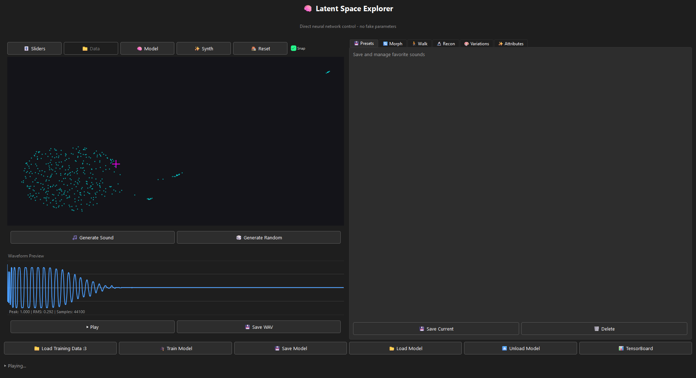
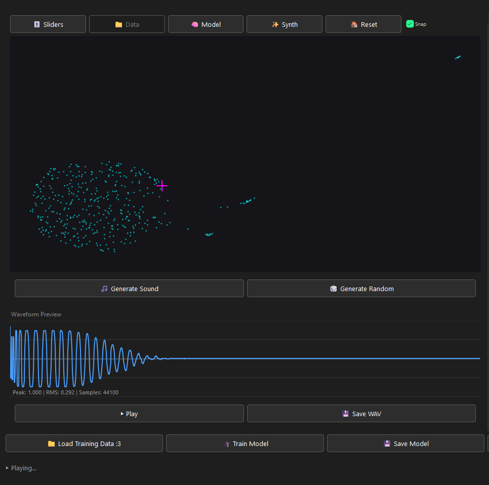
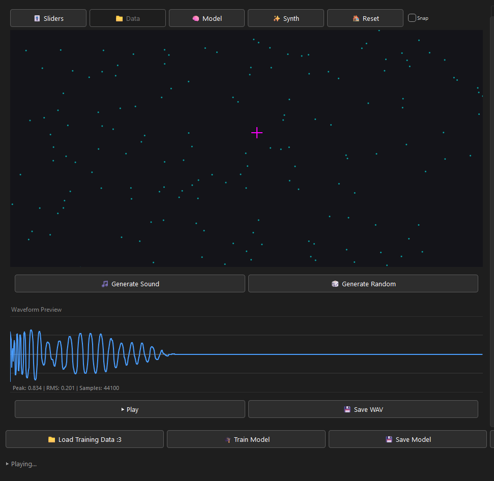
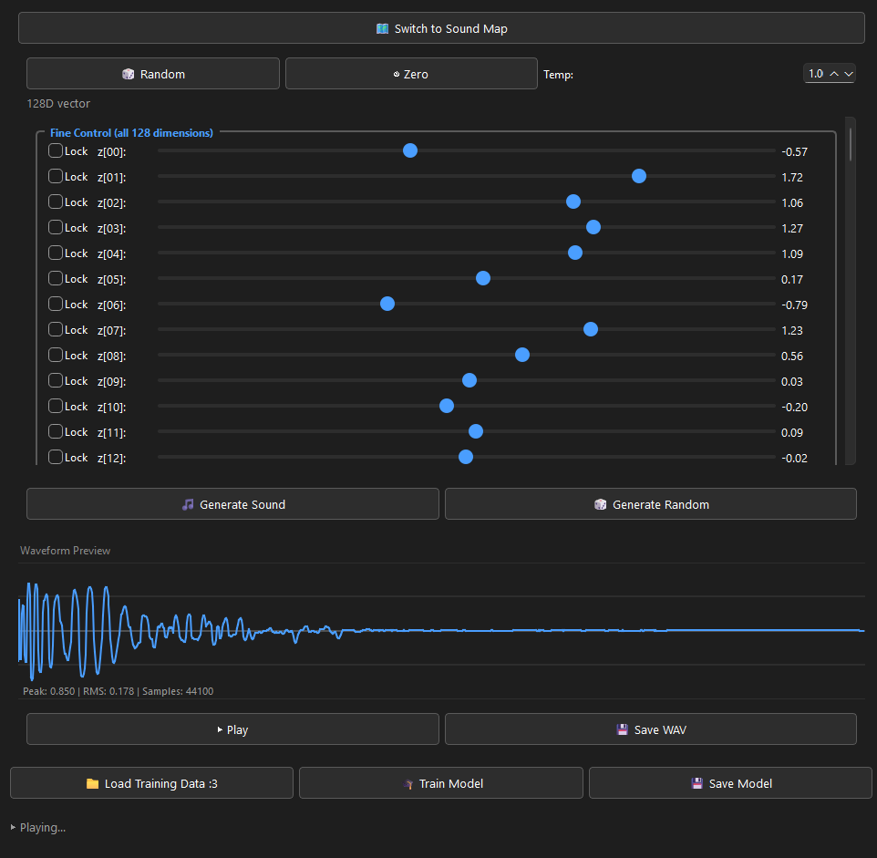
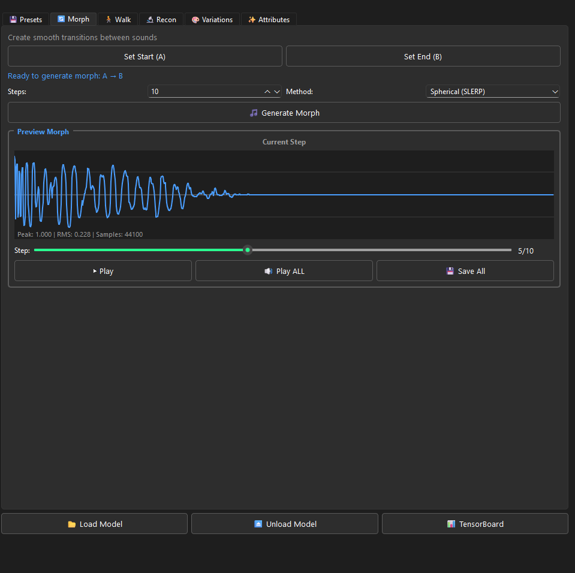
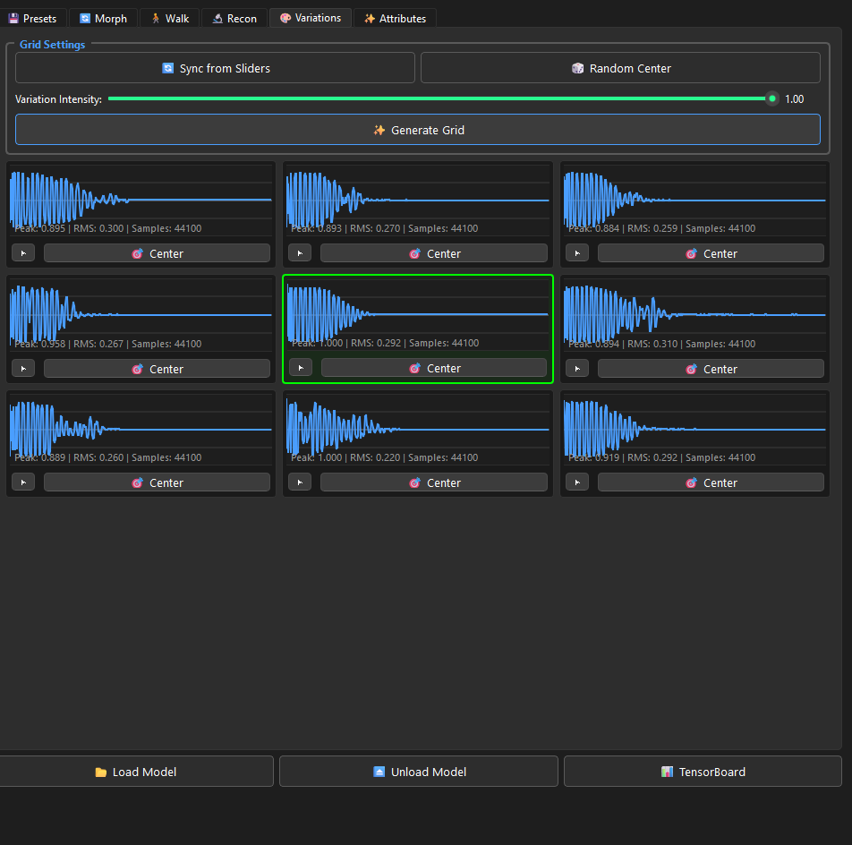

# LatentAudio: Phase 7 High-Fidelity Neural Manifold Exploration

LatentAudio is an advanced neural audio synthesis system that provides direct, high-fidelity exploration of learned sound manifolds. Unlike traditional synthesisers, LatentAudio utilizes a sophisticated Variational Autoencoder (VAE) to learn a continuous latent space of sound, allowing for seamless morphing, exploratory walks, and semantic attribute manipulation.



**This project is a vibe coded variation of a previous passion project that used the same UI but was reworked to have a better network and nicer quality. Feel free to ask OpenCode `antigravity-gemini-3-flash` about it. it was one of the more helpful models i used for this. can give good training parameters, and help rework the codebase. BUT PLEASE REMEMBER TO BACK UP BEFORE GIVING IT FULL CONTROL FOR OBVIOUS REASONS. Feel free to fork, make changes and fix any code mistakes. this is just so others can play with and learn.**

**Side Note: There is a Vae and a Simple Vae in the code files. the code is currently configured to use the SimpleVae as thats the one we rewrote to work... not sure if normal Unet Vae even works anymore have yet to test it. Focus was on simple Vae and Vram memory efficiency.**

## 🚀 Getting Started
### 1. Prerequisites
- **Python 3.10+**
- **NVIDIA GPU** (8GB+ VRAM recommended for training)
- **FFmpeg**: Required for audio loading. 
- *Windows*: 
```bash
choco install ffmpeg
```
or download from [gyan.dev](https://www.gyan.dev/ffmpeg/builds/).

### 2. Installation
1. **Clone the repository**:
```bash
git clone https://github.com/yourusername/LatentAudio.git
```
```bash
cd LatentAudio
```

2. Create a virtual environment:
   ```bash
   python -m venv venv
   ```

   ```bash
   .\venv\Scripts\activate
   ```

3. Install PyTorch (CUDA Support):
   Visit pytorch.org (https://pytorch.org/get-started/locally/) to find the correct command for your CUDA version. For CUDA 11.8:
      ```bash
      pip install torch torchvision torchaudio --index-url https://download.pytorch.org/whl/cu118
      ```
   
4. Install LatentAudio:
    ```bash
    pip install -e .
    ```

3. Usage
- Launch the Explorer GUI:
    ```bash
    latent-ui
    ```
- Start Training via CLI:
    ```bash
    latent-train --help
    ```

Trained 128D Model: [here](https://huggingface.co/Meowmeow42/LatentAudio/tree/main)

## 🧠 Model Architecture: The Phase 7 Engine

The core of LatentAudio is a **1D Convolutional U-Net VAE**, specifically engineered for high-sample-rate audio generation (44.1kHz).


### 1. 1D Convolutional U-Net Backbone
The model uses a symmetric architecture with deep 1D convolutional layers and **ResBlock1d** modules. This allows the network to capture both micro-temporal textures and long-form structural characteristics of audio.

### 2. The "No-Cheat" Skip-Generator Architecture
Standard U-Net architectures rely on skip connections from the encoder to the decoder to preserve high-frequency details. However, these connections do not exist during inference (generation).
*   **The Problem**: Models that "cheat" using encoder skips during training often produce blurry or low-quality audio when generating from pure noise.
*   **The Solution**: LatentAudio implements a dedicated **SkipGenerator**. During training, the model learns to "hallucinate" these skip features directly from the latent vector $z$. A **Skip Consistency Loss** (MSE + Cosine Similarity) forces these hallucinations to match reality, ensuring zero quality loss during pure generation.

### 3. Anti-Collapse Stability Protocol
To prevent "Posterior Collapse" (where the model ignores the latent space), LatentAudio employs:
*   **Per-Dimension Free Bits**: Ensures every latent dimension stores a minimum threshold of information ($0.25$ bits), maintaining a dense and meaningful manifold.
*   **Logvar Flooring**: Prevents variance collapse by enforcing a hard minimum on latent variance.
*   **Separate $\mu/\sigma$ Networks**: Decouples the learning of latent position from latent spread, significantly improving stability.

## 🎵 Training Objective & Fidelity

LatentAudio uses a hybrid multi-task loss function to ensure maximum spectral and temporal accuracy.

*   **Multi-Resolution STFT (MR-STFT)**: A perceptual loss that aggregates spectral convergence and log-magnitude across multiple window sizes (128 to 4096 samples).
*   **Phase-Aware Training**: Includes a complex-plane component in the STFT loss to capture timing and phase relationships, resulting in "sharper" transients.
*   **Pre-Emphasis Filter**: Applied before loss calculation to protect high-frequency textures and prevent "dull" sounding reconstructions.
*   **Headroom Management**: The decoder features a **Phase 7 -1dB Buffer** ($0.9 \times \text{Tanh}$), preventing digital clipping and ensuring hardware-safe outputs.

## Training Notes

LOGS OF MY SUCCESSFUL TRAINING ARE RECORDED IN LOGS FOLDER. you can use tensorboard to open them, implementation is currently broken but running normally still works to read the logs. `tensorboard --logdir '.\logs'` make sure you use right path based on your location.

Requires: around 10gb+ gb of vram, i used an RTX 3060 12gb vram, with 40 gb of RAM and a small 406 Drum KICK dataset (just kicks no other sounds used, though it will learn other sounds just fine, this was just the *BASS*ic concept that got me to create this, might make a VST plugin for it later.)
- Larger dataset might require more vram though i tried to make memory efficient loading a thing. 
- defaults to 1 second long audio. if you decrease audio length it will reduce vram usage. 
- make sure your dataset correctly matches the length otherwise ui will trim the longer files to match. some preprocessing scripts in the scripts folder might help though i suggest reading them carefully to make sure its what you want.
- (or just do whatever tbh its your vram :3)

## 🎛️ Interactive Explorer & Features

LatentAudio features a modern PyQt6-based interface designed for deep sound sculpting and manifold navigation.

### 🗺️ Manifold Navigation
#### Sound Map
*   **The Sound Map**: A 2D projection of the entire latent space. Switch between **Data Mode** (visualizing your training set), **Model Mode** (cached coordinates), or **Synth Mode** (hallucinated exploration). 

(VERY GOOD FOR THE MODEL'S UTILITY,I prefer this mode over the sliders.)


*   **Snap & Blend**: Enable "Snap" to jump to real training examples, (each point is a reconstructed piece from the dataset using the latents) or disable it to smoothly **Blend** between multiple neighboring sounds using Inverse Distance Weighting (creates new sounds by mixing the weights of nearby points).
*   **Zoom & PAN**: Lets you zoom in with scroll wheel and pan with mouse. double click to reset map. (makes it easier to explore the sound map and get in between dots for unique sounds.)


#### Sliders
*   **Latent Sliders**: Direct, low-level access to all 128 dimensions of the neural network for precise sonic surgery. (kinda of confusing to use and not my favorite, but its useful for precision)

*   **Random**: Places sliders randomly, based on temp settings.
*   **Zero**: Zeros out the sliders.
*   **Generate Sound**: Creates the soundwave using the current slider settings. (could honestly be removed if we just update waves in realtime since model processes extremely fast in realtime)
*   **Play**: Self explanatory, plays the currently shown audiowave.
*   **Generate Random**: Randomizes sliders based on temp, creates soundwave and plays the sound. (used to make random exploration not so tedious)


### 🧪 Exploration Tools

*   **Smooth Morphing**: Create seamless transitions between two latent points using **Linear** or **Spherical (SLERP)** interpolation.

*   **Exploratory Walks**: Generate sequences of sounds using **Momentum-based Random Walks** that stay within the learned distribution while finding novel textures.
*   **Latent Variations**: Instantly generate a "neighborhood" of sounds similar to your current selection to find the perfect version of a texture.

*   **Attribute Manipulation**: Tweak high-level characteristics like **Brightness**, **Noisiness**, and **Loudness** through axes mathematically mapped to the latent space. (sample 1A is Loud *positive*, Sample 1B is quiet *negative*, NamedAttribute now moves the sliders up or down based on what it thinks controls loudness)

### 🔬 Analysis & Training
*   **Neural Reconstruction**: Drag-and-drop any external audio file into the **Recon Tab** to see how the VAE perceives and re-synthesizes it. (really only useful to see how your training data is reconstructed, after training. and quickly setting your latent spaces to that point. can use random audios but its just weird noise lol)
*   **Integrated Training Suite**: Configure and launch training sessions directly from the UI. Features real-time loss tracking and one-click **TensorBoard** integration. (Actually tensorboard kinda broken, i should fix it.. tries to launch but fails.. you should launch normally in terminal with after it fails, training starts normally regardless.)
*   **Smart VRAM Management**: Use the **Unload** feature to offload heavy neural weights from your GPU to system RAM, keeping the application responsive while you work in other software. (i really just wanted it to clear the cached model. but i guess this is helpful????? probably will fix later lol)

## 📂 Repository Structure

*   `src/latentaudio/core/`: The neural engine (VAE, SkipGenerator, Loss functions).
*   `src/latentaudio/ui/`: The modern PyQt6-based exploration interface.
*   `src/latentaudio/explorer/`: Mathematics for latent walks, interpolation, and presets.
*   `scripts/`: A suite of tools for dataset preparation, health auditing, and model polishing.

## 📋 Phase 7: GUI Configuration Guide
(These are the settings for my successful training)
| GUI Field | Value to Enter | Reason |
| :--- | :--- | :--- |
| Epochs | 1500 | Gives the deep residual skips time to "snap" into alignment. |
| Batch Size | 8 | Optimal for gradient stability and VRAM. |
| STFT Skip Interval | 5 | High-precision check every 5 batches. |
| Latent Dimension | 128 | Standard dimension for complex drum hits. |
| Learning Rate | 0.0001 | The stable "Golden Ratio" for this model. |
| Weight Decay | 0.001 | Prevents the model from getting "lazy" with weights. |
| Gradient Clipping | 1.0 | Important: Increased from 0.5 to handle complex HD gradients. |
| Grad Accumulation | 2 | Effectively simulates a batch size of 16 for smoother learning. |
| Beta KL (β) | 0.001 | Perfectly balances audio fidelity vs. latent organization. |
| KL Warmup Epochs | 150 | Gives the "brain" 150 epochs to learn tone before tightening. |
| Use Cyclical Annealing | Unchecked | We want a steady linear organization for this precision run. |
| Patience | 150 | Standard stability for the LR scheduler. |
| Reduction Factor | 0.5 | Standard stability for the LR scheduler. |

## Want to Increase Batch size?
Havent tried it since i only have 12gb vram and training uses around 10gb.
if you want to move to a larger batch size for even higher fidelity:
1.  Set Batch Size to 16.
2.  Increase Learning Rate to 0.0002. (double LR)
3.  Keep Grad Accumulation at 1 (1 less than 8 batch, this keeps your effective batch size at 16, but speeds up training because you aren't doing redundant backward passes).
4.  Monitor VRAM: Batch size 16 with Phase 7's HD loss (4096 FFT) will use significantly more GPU memory. If you get an "Out of Memory" error, you must revert to Batch 8 with Accumulation 2.

---

TODO: 
- UPDATE THE README TO HOLD TRAINED EXAMPLE MODEL LINK AFTER UPLOAD.
- FIX THE PRESETS TAB (expected behavior: saves latent presets. Currently errors. Not to be confused with Training Presets.)
- Probably rewrite some of the other preset's (training presets) default settings.
- Fix tensorboard button and load up on training start. (currently tries to open, forcibly tries to close whatever is using its port in attempt to work, then fails anyways) (button lies)
- Review the Unload model button's use and functionality. probably fix to just remove loaded model from vram.
- Check if all configs and types are properly set up.

*Ready to explore the latent space of sound? Use `scripts/README.md` to get started with your first dataset.*
